# Entity relationships

Diagrams per domain rather than one unreadable 506-table poster. Cardinality is
shown from the perspective of the parent.

---

## The location tree

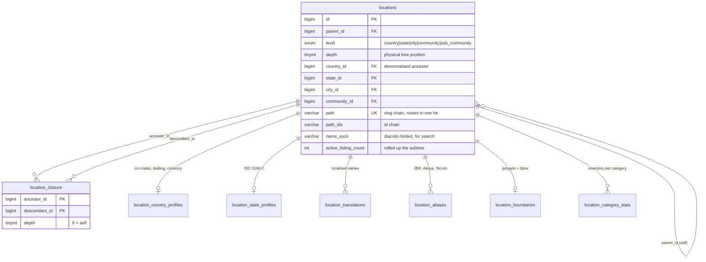

Five semantic tiers in one physical table. `level` answers "what is this", `depth`
answers "where is it in the tree" — they diverge where a country has no state
tier. See [LOCATIONS.md](LOCATIONS.md).

---

## Identity: users, accounts and roles

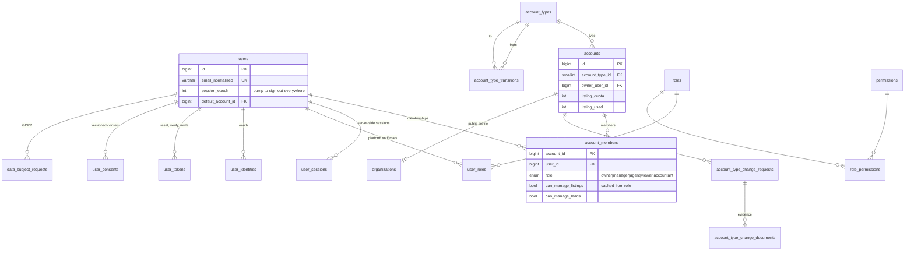

A person is a `user`; what they can do belongs to the `account` they act as.
Many-to-many through `account_members`, which is where the organisation role model
finally has somewhere to live — and what makes account switching and type
conversion ordinary rather than special.

---

## Businesses and agents

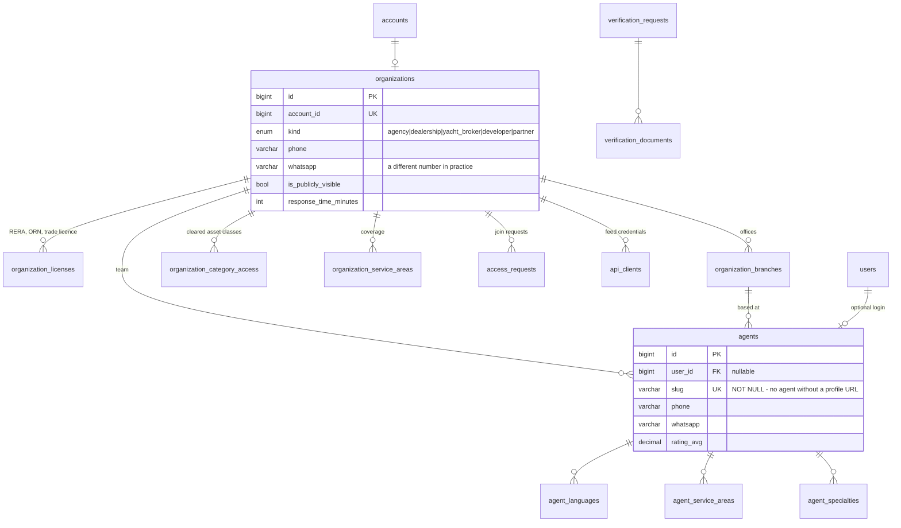

`agents.user_id` is nullable: agencies publish profiles before those people have a
login, and a profile must survive an agent leaving. `agents.slug` is not nullable,
because an agent whose profile cannot be linked to should not exist.

---

## Listings and their specifications

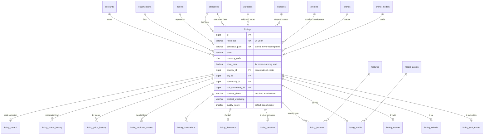

Class-table inheritance: exactly one detail row per listing, chosen by
`root_category_id`. `categories.detail_table` records the mapping so the
application dispatches from data.

---

## Engagement: from lead to deal

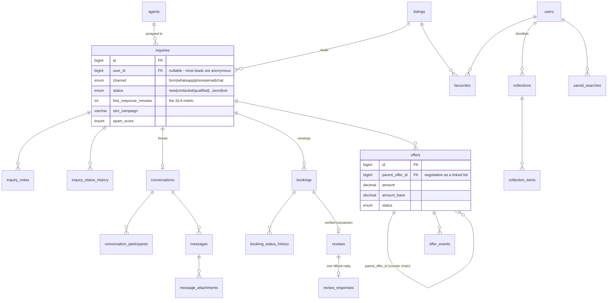

---

## Money

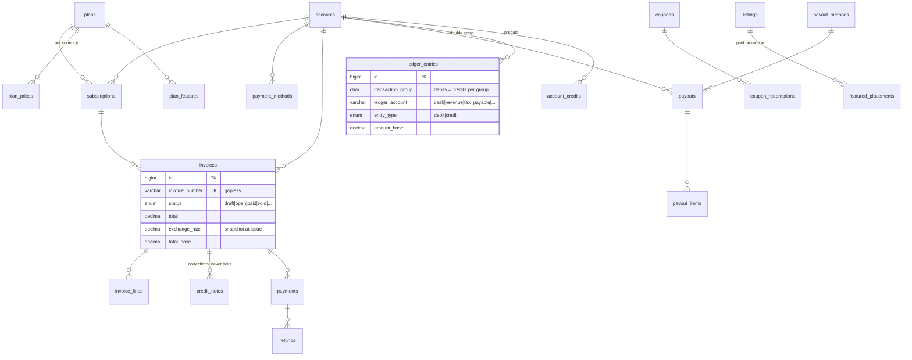

---

## Moderation and audit

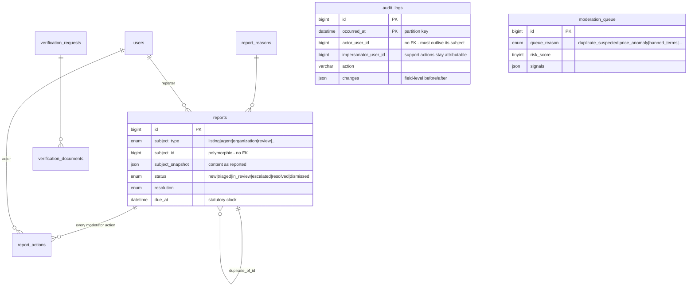

`reports`, `reviews`, `verification_requests` and `moderation_queue` are
polymorphic: one moderation queue covering every content type is worth more than
the foreign key it gives up. `tools/integrity_check.sql` is the replacement for
that missing constraint.

---

## Analytics: raw stream to dashboard

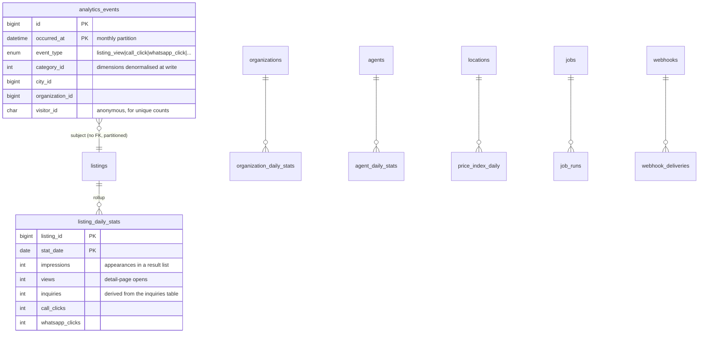

The arrow from `analytics_events` is dashed in intent: there is no foreign key.
InnoDB forbids them on partitioned tables, and a page view must never block on a
lock held against `listings`.

Dashboards read the rollups. Nothing user-facing touches the raw stream.

---

## Editorial

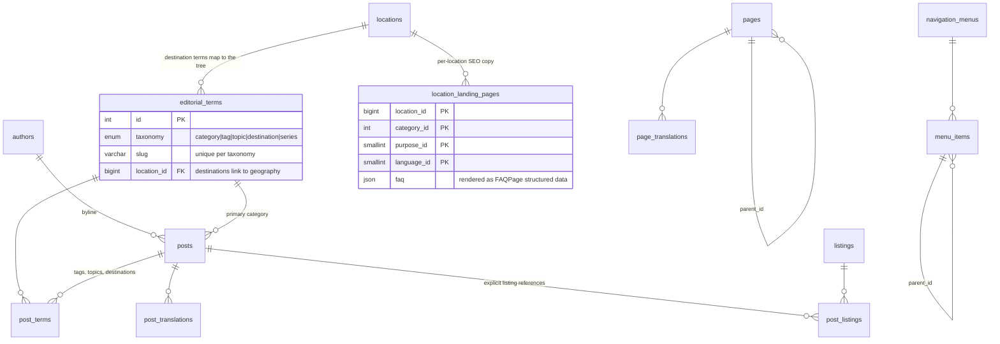

---

## Property inventory: listing versus unit

The distinction the whole property layer turns on. A listing is an
advertisement — it appears, it expires, the same flat is advertised again next
year by a different agency at a different price. The unit is what persists.

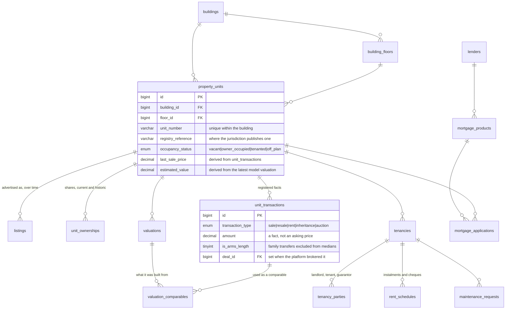

---

## Attribution: touch to credit

Four models score the same conversions differently, and the disagreement is the
point. Credit fractions sum to exactly one per conversion per model — asserted
in `099_platform_finalise.sql`, not assumed.

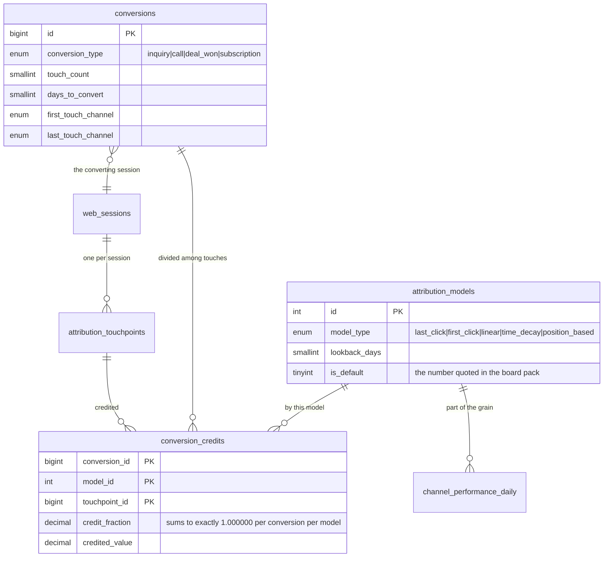

---

## Governance: what is held, why, and for how long

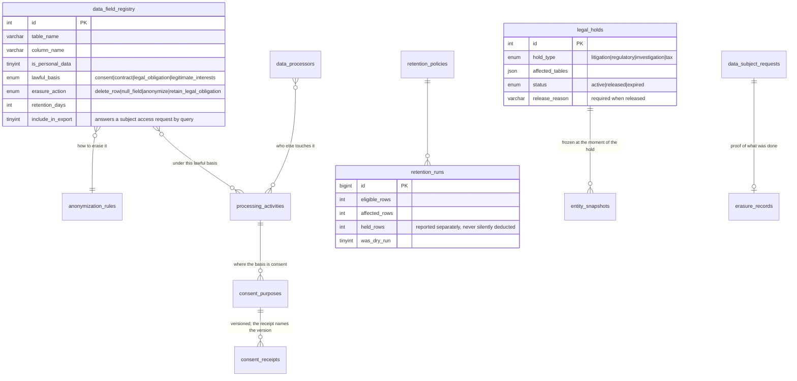
